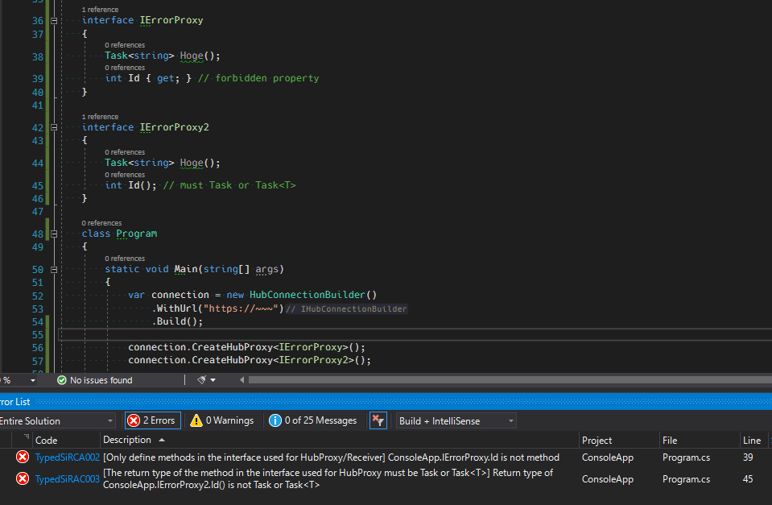
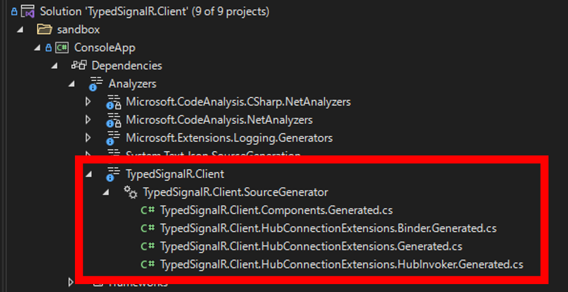

# TypedSignalR.Client

[](https://github.com/nenoNaninu/TypedSignalR.Client/actions/workflows/build-and-test.yaml)

C# [Source Generator](https://docs.microsoft.com/en-us/dotnet/csharp/roslyn-sdk/source-generators-overview) to create strongly typed SignalR Client.

## Table of Contents
- [Install](#install)
- [Why TypedSignalR.Client?](#why-typedsignalrclient)
- [API](#api)
- [Usage](#usage)
  - [Client](#client)
    - [Cancellation](#cancellation)
  - [Server](#server)
- [Recommendation](#recommendation)
  - [Sharing a project](#sharing-a-project)
  - [Client code format](#client-code-format)
- [Compile-time error support](#compile-time-error-support)
- [Generated code](#generated-code)
- [Demo](#demo)

# Install
NuGet: [TypedSignalR.Client](https://www.nuget.org/packages/TypedSignalR.Client/)
```
dotnet add package Microsoft.AspNetCore.SignalR.Client
dotnet add package TypedSignalR.Client
```

# Why TypedSignalR.Client?

The C# SignalR Client is untyped.
To call a Hub (server-side) function, you must specify the function defined in Hub using a string.
You also have to manually determine the return type.
Moreover, Registering a client function called from the server also requires a string, and the parameter types must be set manually.

```cs
// pure SignalR Client

// Specify the hub method to invoke using string.
await connection.InvokeAsync("HubMethod1");

// manually determine the return type.
// The parameter is cast to object.
var guid = await connection.InvokeAsync<Guid>("HubMethod2", "message", 99);

// Registering a client function requires a string, 
// and the parameter types must be set manually.
var subscription = connection.On<string, DateTime>("ClientMethod", (message, dateTime) => {});
```

Therefore, if you change the code on the server-side, the modification on the client-side becomes very troublesome. 
The main cause is that it is not strongly typed.

TypedSignalR.Client aims to generate a strongly typed SignalR Client by sharing interfaces in which the server and client functions are defined. 
Defining interfaces are useful not only for the client-side but also for the server-side.
See [Usage](#usage) section for details.

```cs
// TypedSignalR.Client

// First, create a hubProxy.
IHub hubProxy = connection.CreateHubProxy<IHub>();

// Invoke a hub method through hubProxy.
// You no longer need to specify the function using a string.
await hubProxy.HubMethod1();

// Both parameters and return type are strongly typed.
var guid = await hubProxy.HubMethod2("message", 99);

// The client's function registration is also strongly typed, so it's safe and easy.
var subscription = connection.Register<IReceiver>(new Receiver());

// Defining interfaces are useful not only for the client-side
// but also for the server-side.
// See Usage in this README.md for details.
interface IHub
{
    Task HubMethod1();
    Task<Guid> HubMethod2(string message, int value);
}

interface IReceiver
{
    Task ClientMethod(string message, DateTime dateTime);
}

class Receiver : IReceiver
{
    ...
}

```

# API
This Source Generator provides two extension methods and one interface. 

```cs
static class Extensions
{
    THub CreateHubProxy<THub>(this HubConnection source){...}
    IDisposable Register<TReceiver>(this HubConnection source, TReceiver receiver){...}
}

// An interface for observing SignalR events.
interface IHubConnectionObserver
{
    Task OnClosed(Exception e);
    Task OnReconnected(string connectionId);
    Task OnReconnecting(Exception e);
}
```

Use it as follows. 

```cs
HubConnection connection = ...;

IHub hub = connection.CreateHubProxy<IHub>();
IDisposable subscription = connection.Register<IReceiver>(new Receiver());
```

# Usage
Suppose you have the following interface defined:
```cs
public class UserDefinedType
{
    public Guid RandomId { get; set; }
    public DateTime Datetime { get; set; }
}

// The return type of the client-side method must be Task. 
public interface IClientContract
{
    // Of course, user defined type is OK. 
    Task ClientMethod1(string user, string message, UserDefinedType userDefine);
    Task ClientMethod2();
}

// The return type of the method on the hub-side must be Task or Task <T>. 
public interface IHubContract
{
    Task<string> HubMethod1(string user, string message);
    Task HubMethod2();
}

class Receiver1 : IClientContract
{
    // implementation
}

class Receiver2 : IClientContract, IHubConnectionObserver
{
    // implementation
}
```

## Client
It's very easy to use. 
```cs

HubConnection connection = ...;

var hub = connection.CreateHubProxy<IHubContract>();
var subscription1 = connection.Register<IClientContract>(new Receiver1());

// When an instance of a class that implements IHubConnectionObserver is registered (Receiver2 in this case), 
// the method defined in IHubConnectionObserver is automatically registered regardless of the type argument. 
var subscription2 = connection.Register<IClientContract>(new Receiver2());

// Invoke hub methods
hub.HubMethod1("user", "message");

// Unregister the receiver
subscription.Dispose();
```

### Cancellation
In pure SignalR, `CancellationToken` is passed for each invoke.

On the other hand, in TypedSignalR.Client, `CancellationToken` is passed only once when creating HubProxy.
The passed `CancelationToken` will be used for each invoke internally.

```cs
var cts = new CancellationTokenSource();

// The following two are equivalent.

// 1: pure SignalR
var ret=  await connection.InvokeAsync<string>("HubMethod1", "user", "message", cts.Token);
await connection.InvokeAsync("HubMethod2", cts.Token);

// 2: TypedSignalR.Client
var hubProxy = connection.CreateHubProxy<IHubContract>(cts.Token);
var ret = await hubProxy.HubMethod1("user", "message");
await hubProxy.HubMethod2();
```

## Server
Using the interface definitions, you can write as follows on the server-side (ASP.NET Core). 
TypedSignalR.Client is not nessesary.

```cs
using Microsoft.AspNetCore.SignalR;

public class SomeHub : Hub<IClientContract>, IHubContract
{
    public async Task<string> HubMethod1(string user, string message)
    {
        var instance = new UserDefinedType()
        {
            Guid = Guid.NewGuid(),
            DateTime = DateTime.Now,
        };

        // broadcast
        await this.Clients.All.ClientMethod1(user, message, instance);
        return "OK!";
    }

    public async Task HubMethod2()
    {
        await this.Clients.Caller.ClientMethod2();
    }
}
```
# Recommendation
## Sharing a project
I recommend that these interfaces be shared between the client-side and server-side project, for example, by project references.

```
server.csproj => shared.csproj <= client.csproj
```

## Client code format
I think it is easier to handle if you write the client code in the following format.

```cs
class Client : IReceiver, IHubConnectionObserver, IDisposable
{
    private readonly IHub _hubProxy;
    private readonly IDisposable _subscription;
    private readonly CancellationTokenSource _cancellationTokenSource = new();

    public Client(HubConnection connection)
    {
        _hubProxy = connection.CreateHubProxy<IHub>(_cancellationTokenSource.Token);
        _subscription = connection.Register<IReceiver>(this);
    }

    // implementation
}
```


# Compile-time error support
This library has some restrictions, including those that come from server-side implementations.

- Type argument of `CreateHubProxy/Register` method must be an interface.
- Only methods must be defined in the interface used for `CreateHubProxy/Register`.
  - It is forbidden to define properties.
- The return type of the method in the interface used for `CreateHubProxy` must be `Task` or `Task<T>`.
- The return type of the method in the interface used for `Register` must be `Task`.

It is very difficult for humans to properly comply with these restrictions.
So, this library looks for parts that do not follow the restriction and report detailed errors at compile-time. 
Therefore, no run-time error occurs. 



# Generated code
In this section, we will briefly explain generated code.
The actual generated code can be seen in the Visual Studio.



TypedSignalR.Client checks the type argument of a methods `CreateHubProxy` and `Register` and generates the following code based on it.

If you call the methods `connection.CreateHubProxy<IHubContract>()` and `connection.Register<IClientContract>(new Receiver())`, the following code will be generated (simplified here). 

```cs
public static partial class Extensions
{
    private class HubInvoker : IHubContract
    {
        private readonly HubConnection _connection;
        private readonly CancellationToken _cancellationToken;
        
        public HubInvoker(HubConnection connection, CancellationToken cancellationToken)
        {
            _connection = connection;
            _cancellationToken = cancellationToken;
        }

        public Task<string> HubMethod1(string user, string message)
        {
            return _connection.InvokeCoreAsync<string>(nameof(HubMethod1), new object[] { user, message }, _cancellationToken);
        }

        public Task HubMethod2()
        {
            return _connection.InvokeCoreAsync(nameof(HubMethod2), Array.Empty<object>(), _cancellationToken);
        }
    }

    private static CompositeDisposable BindIClientContract(HubConnection connection, IClientContract receiver)
    {
        var d1 = connection.On<string, string UserDefine>(nameof(receiver.ClientMethod1), receiver.ClientMethod1);
        var d2 = connection.On(nameof(receiver.ClientMethod2), receiver.ClientMethod2);

        var compositeDisposable = new CompositeDisposable();
        compositeDisposable.Add(d1);
        compositeDisposable.Add(d2);
        return compositeDisposable;
    }

    static Extensions()
    {
        HubInvokerConstructorCache<IHubContract>.Construct = static (connection, cancellationToken) => new HubInvoker(connection, cancellationToken);
        ReceiverBinderCache<IClientContract>.Bind = BindIClientContract;
    }
}
```
The generated code is used through the API as follows. 
```cs
public static partial class Extensions
{
    // static type caching
    private static class HubInvokerConstructorCache<T>
    {
        public static Func<HubConnection, T> Construct;
    }

    // static type caching
    private static class ReceiverBinderCache<T>
    {
        public static Func<HubConnection, T, CompositeDisposable> Bind;
    }

    public static THub CreateHubProxy<THub>(this HubConnection connection, CancellationToken cancellationToken = default)
    {
        return HubInvokerConstructorCache<THub>.Construct(connection, cancellationToken);
    }

    public static IDisposable Register<TReceiver>(this HubConnection connection, TReceiver receiver)
    {
        if(typeof(TReceiver) == typeof(IHubConnectionObserver))
        {
            // special subscription
            return new HubConnectionObserverSubscription(connection, receiver as IHubConnectionObserver);;
        }

        var compositeDisposable = ReceiverBinderCache<TReceiver>.Bind(connection, receiver);

        if (receiver is IHubConnectionObserver hubConnectionObserver)
        {
            var subscription = new HubConnectionObserverSubscription(connection, hubConnectionObserver);
            compositeDisposable.Add(subscription);
        }

        return compositeDisposable;
    }
}
```

# Demo
First, launch server.
Then access it from your browser and open the console(F12). 

```
git clone https://github.com/nenoNaninu/TypedSignalR.Client.git
cd sandbox 
dotnet run --project SignalR.Server/SignalR.Server.csproj
```

Execute the console app in another shell. 

```
cd sandbox 
dotnet run --project SignalR.Client/SignalR.Client.csproj
```
